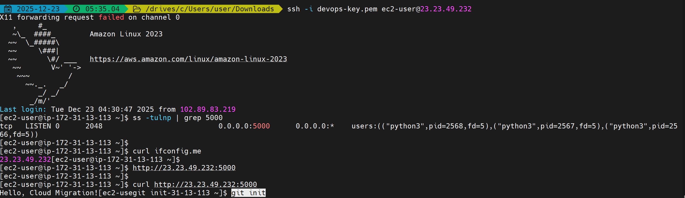
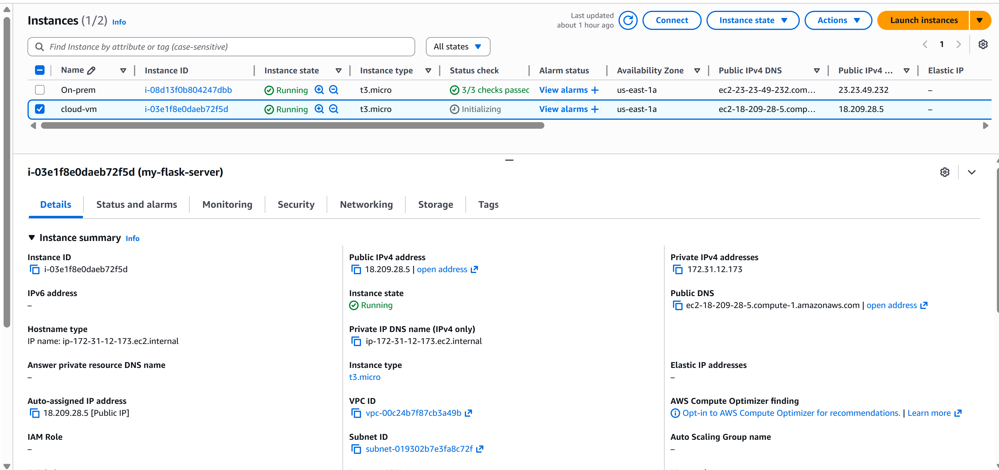
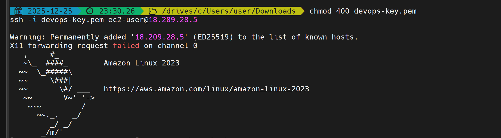
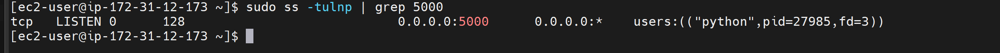
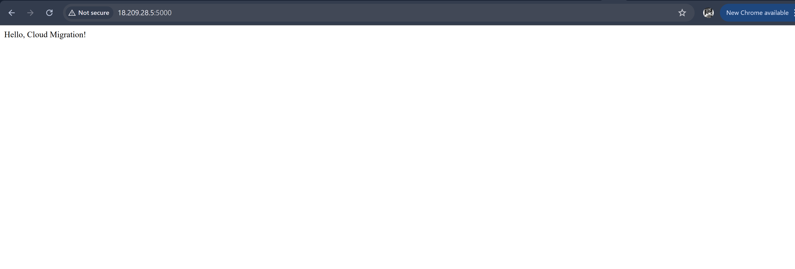

# Cloud Migration Project: Flask Application

This project demonstrates a **lift-and-shift migration** of a simple Flask web application from an on-premises environment to a cloud server (AWS EC2), with a **CI/CD pipeline** using GitHub Actions.

## Project Overview

- **Application**: Flask web app serving a simple "Hello, Cloud Migration!" message.
- **On-Premises Environment**: AWS instance
- **Cloud Environment**: AWS EC2 instance running the Flask app.
- **CI/CD**: GitHub Actions automatically deploys code from GitHub to EC2 on each push to the `main` branch.
- **Deployment Method**: SSH + virtual environment.

## Screenshots

**On-Premises Flask App Running**

 **AWS EC2 Instance Running**

 **SSH Access into EC2**

 **Flask App Running on Cloud VM**

 **Port Listening Verification**

 **Browser Access**

 **Security Group Inbound Rules (Optional)**

